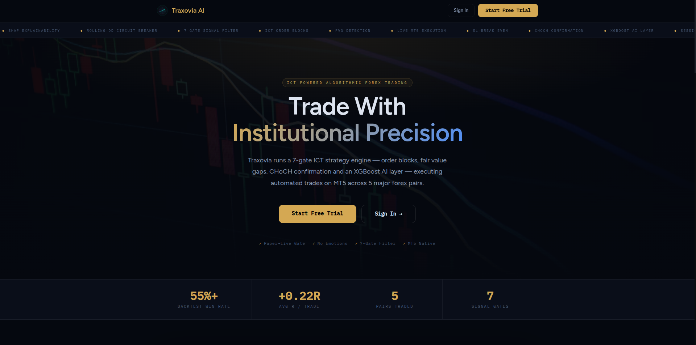
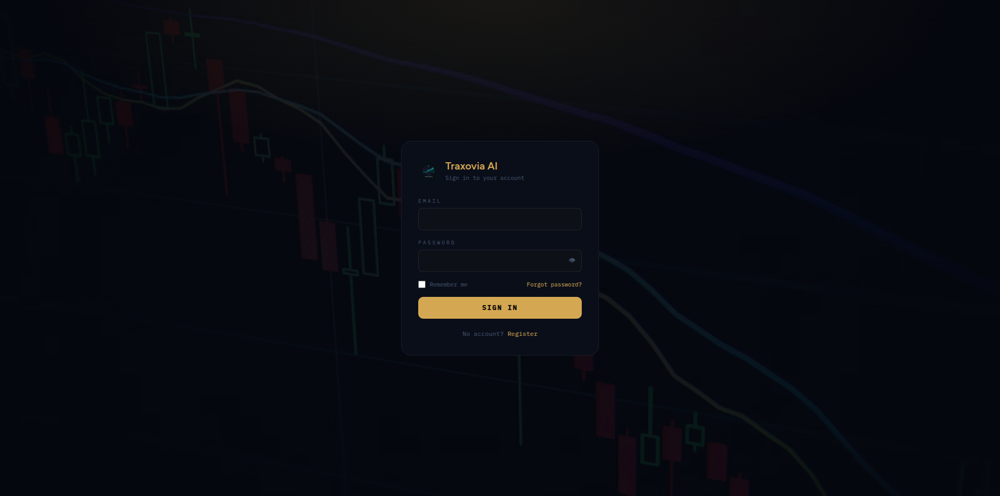
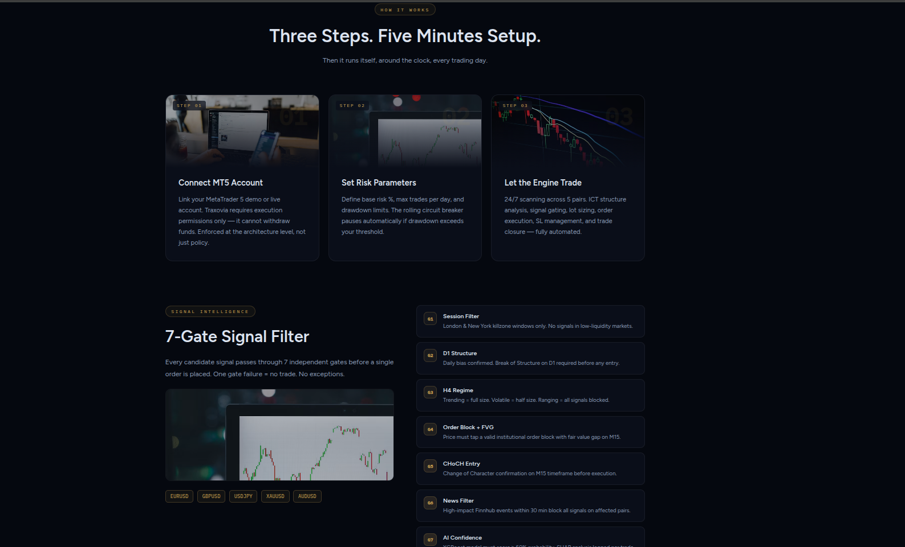

# Traxovia AI — Algorithmic Forex Trading Platform

<div align="center">


**ICT-powered algorithmic trading with a 7-gate signal filter, XGBoost AI layer, and live MT5 execution across 5 major forex pairs.**

</div>

---

## Screenshots



<p align="center">
  
  
</p>

---

## Overview

Traxovia runs a 7-gate ICT strategy engine — order blocks, fair value gaps, CHoCH confirmation, and an XGBoost AI confidence layer — executing automated trades on MetaTrader 5 across 5 major forex pairs. Every signal must pass all 7 gates before a single order is placed.

**Key stats from backtesting:**
- 55%+ win rate
- +0.22R average per trade
- 5 pairs traded (EURUSD, GBPUSD, USDJPY, XAUUSD, AUDUSD)
- 7 independent signal gates

---

## Features

- **7-Gate Signal Filter** — Session, D1 Structure, H4 Regime, Order Block + FVG, CHoCH Entry, News Filter, AI Confidence. One gate failure = no trade
- **XGBoost AI Layer** — ML model validates every signal; SHAP explainability for transparency
- **Live MT5 Execution** — Connects to MetaTrader 5 via bridge; execution-only permissions
- **Paper & Live Trading** — Separate paper trading loop for safe strategy testing
- **Rolling Drawdown Circuit Breaker** — Auto-pauses trading if drawdown exceeds threshold
- **Backtesting Engine** — Test strategies against historical data before going live
- **Real-time Analytics** — Live portfolio tracking, trade history, and performance metrics
- **Multi-tier Subscriptions** — Stripe-powered billing (Starter, Trader, Pro, Elite plans)
- **Telegram Bot** — Real-time signal alerts, trade notifications, and bot commands
- **Referral System** — Built-in affiliate/referral tracking
- **Admin Panel** — User management, pair configuration, audit logs
- **Mobile App** — Companion mobile application

---

## Tech Stack

| Layer | Technology |
|---|---|
| **Backend** | Python 3.11, FastAPI, Celery, Redis |
| **Database** | PostgreSQL |
| **Frontend** | React (Vite), Tailwind CSS |
| **ML / AI** | XGBoost, SHAP, scikit-learn |
| **Trading** | MetaTrader 5 (MT5 Bridge) |
| **Infrastructure** | Docker, Docker Compose, Nginx |
| **Payments** | Stripe |
| **Notifications** | Telegram Bot API, Finnhub (news/market data) |
| **Auth** | JWT-based authentication |

---

## Quick Start

```bash
# 1. Clone the repo
git clone https://github.com/Abdurrahman775/traxovia.git
cd traxovia

# 2. Copy environment file and fill in your keys
cp .env.example .env
# Required: JWT_SECRET, STRIPE_KEY, FINNHUB_KEY, TELEGRAM_BOT_TOKEN, DATABASE_URL

# 3. Start with Docker (recommended)
docker-compose up -d

# Or run manually:

# Backend
pip install -r requirements.txt
python main.py

# Frontend
cd frontend && npm install && npm run dev

# Celery worker (signals, tasks)
celery -A core.celery_app worker --loglevel=info

# Paper trading loop (safe mode)
python paper_trading_loop.py

# Live trading loop
python live_trading_loop.py
```

---

## Project Structure

```
traxovia/
├── api/                  # FastAPI route handlers (auth, billing, signals, trades, admin)
├── core/                 # Core business logic, configs, Celery app
├── models/               # XGBoost ML models for signal generation
├── data/                 # Market data processing pipeline
├── data_engine/          # Data ingestion and feature engineering
├── backtest/             # Backtesting engine
├── database/             # DB connection, migrations, schemas
├── mt5_bridge/           # MetaTrader 5 execution bridge
├── scheduler/            # Celery beat scheduled tasks
├── tg_bot/               # Telegram bot integration
├── notifications/        # Alert system (email, telegram)
├── frontend/             # React SPA (Vite + Tailwind)
├── mobile/               # Mobile app
├── infra/                # Nginx config, systemd service files
├── scripts/              # Utility and maintenance scripts
├── tests/                # Test suite (pytest)
└── docs/                 # Documentation and screenshots
```

---

## Environment Variables

| Variable | Description |
|---|---|
| `JWT_SECRET` | Secret key for JWT token signing |
| `DATABASE_URL` | PostgreSQL connection string |
| `STRIPE_SECRET_KEY` | Stripe API secret key |
| `FINNHUB_API_KEY` | Finnhub market data & news API key |
| `TELEGRAM_BOT_TOKEN` | Telegram bot token for notifications |
| `REDIS_URL` | Redis connection string (for Celery) |

---

## The 7-Gate Signal Filter

Every candidate signal must pass all 7 gates before execution:

| Gate | Name | Description |
|---|---|---|
| G1 | Session Filter | London & New York killzone windows only |
| G2 | D1 Structure | Break of Structure on D1 required |
| G3 | H4 Regime | Trending = full size · Volatile = half size · Ranging = blocked |
| G4 | Order Block + FVG | Must tap institutional OB with fair value gap on M15 |
| G5 | CHoCH Entry | Change of Character confirmation on M15 |
| G6 | News Filter | High-impact Finnhub events within 30 min block the signal |
| G7 | AI Confidence | XGBoost model must score ≥60% probability |

---

## License

This project is licensed under the [MIT License](LICENSE).

---

## Author

**Abdurrahman Alhassan** — Full-Stack Developer · Nigeria  
[GitHub](https://github.com/Abdurrahman775) · [Portfolio](https://abdurrahman775.vercel.app)
